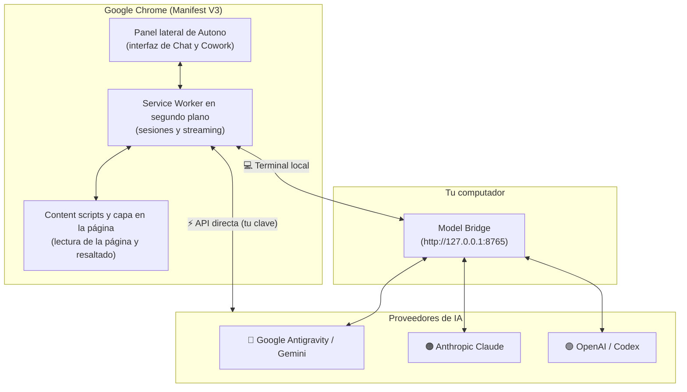

<div align="center">
  
  <h1>Autono</h1>
  <h3>⚡ El agente de IA que vive en el panel lateral de tu Chrome</h3>
  <p>
    Conversa con la página que estás viendo, o deja que la IA <b>haga clic, escriba y navegue por ti</b>.<br/>
    Funciona con <b>Google Gemini · Anthropic Claude · OpenAI / ChatGPT</b>, usando una <i>terminal local</i> o tu propia <i>API key</i>.
  </p>
  <p>
    
    
    
    
  </p>
  <p>
    🌐 <a href="README.md">English</a> · <b>Español</b>
  </p>
  <p>
    <a href="#-inicio-rápido-5-minutos">Inicio rápido</a> ·
    <a href="#-qué-puedes-hacer-con-autono">Casos de uso</a> ·
    <a href="#-instalación-paso-a-paso">Instalación</a> ·
    <a href="#-cómo-usar-autono">Cómo usarlo</a> ·
    <a href="#-problemas-comunes-y-preguntas-frecuentes">Preguntas frecuentes</a>
  </p>
</div>

---

> [!TIP]
> **Si Autono te ahorra tiempo, regálale una ⭐ en GitHub.** Es la forma más fácil de ayudar a que otras personas lo encuentren.

## 📖 Contenido

1. [¿Qué es Autono?](#-qué-es-autono)
2. [¿Qué puedes hacer con Autono?](#-qué-puedes-hacer-con-autono)
3. [Inicio rápido (5 minutos)](#-inicio-rápido-5-minutos)
4. [Instalación paso a paso](#-instalación-paso-a-paso)
5. [Cómo usar Autono](#-cómo-usar-autono)
6. [Proveedores y modelos compatibles](#-proveedores-y-modelos-compatibles)
7. [Cómo funciona](#-cómo-funciona)
8. [Atajos de teclado](#-atajos-de-teclado)
9. [Actualizar y recargar](#-actualizar-y-recargar)
10. [Problemas comunes y preguntas frecuentes](#-problemas-comunes-y-preguntas-frecuentes)
11. [Seguridad y privacidad](#-seguridad-y-privacidad)
12. [Estructura del repositorio](#-estructura-del-repositorio)
13. [Contribuir](#-contribuir) · [Licencia](#-licencia)

---

## 🌟 ¿Qué es Autono?

**Autono** es una **extensión de Chrome** gratuita y de código abierto (Manifest V3) que pone un asistente de IA potente en el **panel lateral** de Chrome, justo al lado de la página que estás leyendo.

Tiene dos modos:

| Modo | Qué hace | Ejemplo |
| :--- | :--- | :--- |
| 💬 **Chat** | Lee la página en la que estás y responde tus preguntas sobre ella. No modifica la página. | *"Resume este artículo en 5 puntos."* |
| 🤖 **Cowork** | Un **agente** que planea una tarea de varios pasos y la hace en tu navegador: hace clic, escribe, baja la página y navega, e informa lo que va haciendo. Puedes pausarlo o tomar el control cuando quieras. | *"Busca el vuelo directo más barato a Madrid el próximo viernes y rellena el formulario de búsqueda."* |

**Por qué gusta**

- 🔌 **Tú eliges el cerebro.** Usa modelos de Gemini, Claude u OpenAI y cámbialos con un clic.
- 🧰 **Dos formas de conectarte.** Con una **terminal local** (la herramienta de línea de comandos de cada proveedor, a través de un programa pequeño llamado *Model Bridge*) **o** pegando tu propia **API key** para hablar directo con el proveedor.
- 🔒 **Privado por diseño.** No hay ningún servidor de Autono en el medio. Tus claves y tus chats se quedan en tu computador.
- 🧠 **Controlas cuánto piensa.** Niveles de razonamiento Bajo / Medio / Alto según el modelo.
- 🆓 **Gratis y de código abierto (MIT).**

---

## 🎯 ¿Qué puedes hacer con Autono?

Situaciones reales donde Autono ayuda. Puedes copiar cualquiera de los ejemplos.

### 📚 Estudiantes e investigadores
- *"Explícame el método de este paper como si tuviera 15 años y dime sus 3 limitaciones principales."*
- *"Extrae todas las tablas de esta página y dámelas en CSV."*
- Las respuestas de matemáticas y ciencias muestran las fórmulas en **LaTeX** y el código con colores.

### 💻 Desarrolladores
- Selecciona código en cualquier página (documentación, Stack Overflow, GitHub) → clic en el botón flotante **✨ Autono** → *"¿Qué hace esto y dónde podría fallar?"*
- *"Escribe el código completo para esto, sin dejar partes pendientes."* Autono devuelve archivos completos que puedes copiar o descargar.
- Usa el **selector de elementos** para señalar algo de la página y preguntar *"¿por qué este botón está desalineado?"*

### 🛒 Compras, viajes y trámites (modo Cowork)
- *"Compara los tres portátiles que tengo abiertos en pestañas y dime cuál es la mejor compra."*
- *"Abre la página de reservas, busca estas fechas y detente antes de pagar."*
- Autono puede pedirte aprobación con **tarjetas de aprobación** interactivas antes de pasos importantes.

### ✍️ Escritura y trabajo de oficina
- Selecciona un párrafo → *"Reescríbelo con un tono más profesional."*
- *"Resume este hilo largo de correos y redacta una respuesta amable."*
- Adjunta varias pestañas como contexto y haz preguntas sobre todas a la vez.

### 🧪 Usuarios avanzados y automatización
- **Comandos con barra** como `/goal` (trabaja hasta terminar), `/schedule` (tareas recurrentes), `/grill-me` (te entrevista antes de actuar), `/teamwork` y `/learn` (convierte un trabajo terminado en una habilidad reutilizable).
- Conecta **servidores MCP** y crea tus propias **habilidades (skills)**.
- **Modo Shadow**: deja que tu PC se suspenda o se apague sola cuando termine una tarea larga.

---

## ⚡ Inicio rápido (5 minutos)

Elige **un** camino. Siempre puedes agregar el otro después.

| | 🅰️ **Camino con API key** (el más simple) | 🅱️ **Camino con terminal local** |
| :--- | :--- | :--- |
| **Necesitas** | Una API key de Google, Anthropic u OpenAI | Una herramienta de terminal con sesión iniciada (Antigravity / Claude Code / Codex) + el Model Bridge |
| **¿Instalar el Bridge?** | ❌ No | ✅ Sí (un solo comando) |
| **Costo** | Pagas por uso con tu clave | Usa tu suscripción / sesión actual |
| **Ideal para** | Empezar rápido | Usar modelos a los que ya tienes acceso desde una terminal |

**Los 3 pasos (para ambos caminos):**

1. **Descarga la extensión** → `git clone https://github.com/MatiasV3B/Autono.git`
2. **Cárgala en Chrome** → `chrome://extensions` → *Modo de desarrollador* → *Cargar descomprimida* → elige la carpeta **`Autono`**.
3. **Conecta un modelo** → abre Autono con <kbd>Alt</kbd> + <kbd>Shift</kbd> + <kbd>A</kbd>, entra a ⚙️ *Configuración* y pega una API key (camino A) o instala el Bridge (camino B). Las instrucciones completas están abajo 👇

---

## 🛠️ Instalación paso a paso

### Paso 0 — Qué necesitas

- **Google Chrome 120 o más nuevo** (o cualquier navegador Chromium con Manifest V3 y panel lateral).
- **Windows 10/11** si vas a usar el **Model Bridge** (camino B). La extensión en sí funciona en cualquier sistema donde corra Chrome.
- **Git** (solo para descargar el proyecto; también puedes usar *Code → Download ZIP* en GitHub).

### Paso 1 — Descarga la extensión

```bash
git clone https://github.com/MatiasV3B/Autono.git
```

### Paso 2 — Cárgala en Chrome

1. Escribe `chrome://extensions` en la barra de direcciones.
2. Activa el **Modo de desarrollador** (interruptor arriba a la derecha).
3. Pulsa **Cargar descomprimida** y elige la carpeta **`Autono`** dentro del proyecto.
4. Pulsa el icono 🧩 de piezas de Chrome y **fija** Autono en la barra de herramientas.

> [!NOTE]
> Si Chrome dice *"No se ha podido cargar la extensión"*, revisa que elegiste la carpeta `Autono` (la que contiene `manifest.json`) y que tienes la última versión (`git pull`).

### Paso 3A — Conectar con una API key (sin Bridge)

1. Abre Autono (<kbd>Alt</kbd> + <kbd>Shift</kbd> + <kbd>A</kbd> o clic en el icono) y entra a ⚙️ **Configuración**.
2. Pega la clave del proveedor que quieras:

| Proveedor | Dónde crear la clave |
| :--- | :--- |
| 🔷 **Google Gemini** | [Google AI Studio → API keys](https://aistudio.google.com/apikey) |
| 🟠 **Anthropic Claude** | [Consola de Anthropic → API keys](https://console.anthropic.com/settings/keys) |
| 🟢 **OpenAI / ChatGPT** | [OpenAI Platform → API keys](https://platform.openai.com/api-keys) |

3. En el selector de modelos elige la pestaña del proveedor y cambia su motor a **API**.
4. Pulsa **Recargar modelos** (🔄) para cargar la lista real de modelos que tu clave puede usar. ¡Listo!

> [!IMPORTANT]
> Trata las API keys como contraseñas. No las compartas ni publiques capturas donde se vean.

### Paso 3B — Conectar con la terminal local (Model Bridge)

El **Model Bridge** es un programa pequeño que corre en tu PC y permite que Autono use las herramientas de línea de comandos en las que ya iniciaste sesión.

1. **Instálalo con un solo comando.** Abre **PowerShell** y ejecuta:

   ```powershell
   irm https://raw.githubusercontent.com/MatiasV3B/ModelBridge/main/install.ps1 | iex
   ```

   Esto instala todo en un entorno aislado (**no necesitas instalar Python**), crea un acceso directo en el escritorio y arranca el Bridge.
2. **Comprueba que funciona.** Abre <http://127.0.0.1:8765/health> en Chrome. Deberías ver algo como `{"status":"online", ...}`.
3. **Inicia sesión en el proveedor que quieras usar** (una sola vez):
   - **Google Antigravity** → el instalador prepara la herramienta `agy`; inicia sesión desde la app del Bridge con el botón *Iniciar sesión*.
   - **Claude** → instala *Claude Code* e inicia sesión.
   - **OpenAI / Codex** → instala el *Codex CLI* e inicia sesión.
4. En el selector de modelos de Autono elige la pestaña del proveedor y deja su motor en **Local Terminal**. Pulsa **Recargar modelos** (🔄) para cargar lo que ofrece tu Bridge.

> [!NOTE]
> Los modelos de la pestaña **Antigravity** que aparecen bajo **"Antigravity · Local Terminal"** siempre se ejecutan en tu terminal local. Los que aparecen bajo **"Gemini API"** siempre usan tu API key de Gemini.

---

## 💡 Cómo usar Autono

### Ábrelo
- Pulsa <kbd>Alt</kbd> + <kbd>Shift</kbd> + <kbd>A</kbd> (**A** de **A**utono) **o** haz clic en el icono de Autono en la barra de herramientas.

### Elige un modelo y cuánto piensa
Pulsa el botón del modelo en la parte de arriba:
- **Pestañas:** `Antigravity` · `Claude` · `OpenAI`.
- **Nivel de razonamiento:** Low / Medium / High (Claude y OpenAI también tienen X-High y Max; Claude Haiku ofrece Fast o Thinking).
- **Motor:** en el panel de vista previa, cambia entre **Local Terminal** y **API**.
- **🔄 Recargar modelos:** trae la lista actual desde tu Bridge y/o tus API keys y deja solo el modelo más nuevo de cada familia, para que la lista sea corta y clara.

### Modo Chat 💬
Pregunta lo que quieras sobre la página. Autono lee su contenido automáticamente (sin modificarla). Puedes adjuntar archivos, otras pestañas o un elemento concreto de la página para dar más contexto.

### Modo Cowork 🤖
Describe un objetivo y Autono:
1. Te muestra un **plan**.
2. Inspecciona la página y ejecuta los pasos (clic, escribir, bajar, navegar).
3. Te informa del progreso y del resultado final.

Mientras trabaja, una capa azul brillante indica que la página está bajo el control de Autono. Puedes **Pausar**, **Reanudar** o **Intervenir** en cualquier momento, y puede pedirte aprobación (tarjetas de aprobación) antes de pasos importantes.

### Atajos útiles dentro de las páginas web
- **✨ Botón de contexto:** selecciona texto en cualquier página y pulsa el botón flotante para preguntar sobre él.
- **Clic derecho → "Ask Autono"** sobre una selección o zona de la página.
- **Icono de adjuntar → selector de elementos:** haz clic en un elemento de la página para adjuntarlo.

### Más funciones
- **Comandos con barra:** escribe `/` en el cuadro de texto para verlos (`/goal`, `/schedule`, `/grill-me`, `/teamwork`, `/learn`, …).
- **Historial de chats** con carpetas, búsqueda y renombrado. Los títulos los genera el modelo automáticamente.
- **Skills personalizadas**, **servidores MCP** y hasta **5 proveedores extra compatibles con OpenAI** (por ejemplo OpenRouter o Groq).
- Opciones de **temas, idioma, tipografía y audio**, y una clave opcional de **búsqueda web** (TinyFish).

---

## 🧠 Proveedores y modelos compatibles

| Proveedor | Terminal local | API directa | Modelos (las versiones más nuevas se cargan solas) |
| :--- | :---: | :---: | :--- |
| 🔷 **Google Antigravity / Gemini** | ✅ vía el Bridge | ✅ API key de Gemini | Gemini 3.8 Flash, 3.7 Flash, 3.6 Flash, 3.1 Pro · GPT-OSS 120B · Claude Sonnet 5.5 y Opus 5.5 (solo terminal local) · más todos los modelos de chat de tu API de Gemini |
| 🟠 **Anthropic Claude** | ✅ Claude Code vía el Bridge | ✅ API key de Anthropic | Claude Sonnet 5.5 · Opus 5.5 · Fable 5.1 · Haiku 4.5 |
| 🟢 **OpenAI / Codex** | ✅ Codex vía el Bridge | ✅ API key de OpenAI | Los modelos GPT y Codex más recientes disponibles para tu cuenta |

> [!NOTE]
> Las listas de modelos cambian rápido. Autono le pregunta a tu Bridge o a tu API por el catálogo actual cada vez que pulsas **Recargar modelos**, y oculta los modelos que no sirven para chat (por ejemplo, variantes de uso de computador, robótica, transcripción o generación de imágenes).

---

## 🏗️ Cómo funciona



En palabras simples: el **panel lateral** es lo que ves, el **service worker** coordina todo y los **content scripts** leen y actúan sobre la página web. Para llegar a un modelo de IA, Autono pasa por el **Model Bridge** de tu propio computador (Terminal local) o llama **directo** al proveedor con tu API key.

---

## ⌨️ Atajos de teclado

| Atajo | Acción |
| :--- | :--- |
| <kbd>Alt</kbd> + <kbd>Shift</kbd> + <kbd>A</kbd> | Abrir / cerrar el panel lateral de Autono |
| <kbd>Enter</kbd> | Enviar el mensaje / iniciar el objetivo |
| <kbd>Shift</kbd> + <kbd>Enter</kbd> | Nueva línea en el cuadro de texto |
| <kbd>Esc</kbd> | Cerrar el selector de modelos / cancelar el selector de elementos |

Puedes cambiar el atajo cuando quieras en `chrome://extensions/shortcuts`.

---

## 🔄 Actualizar y recargar

**Actualizar la extensión**

```bash
cd Autono
git pull origin main
```

Luego abre `chrome://extensions`, pulsa 🔄 **Recargar** en la tarjeta de Autono, cierra y vuelve a abrir el panel lateral y refresca tus pestañas abiertas.

**Actualizar el Model Bridge** — haz doble clic en `Actualizar-AntigravityBridge.bat` dentro de la carpeta del Bridge (o ejecuta `./update.ps1`). Detiene el Bridge, descarga el código nuevo, actualiza solo lo que cambió y lo vuelve a iniciar.

---

## 🩺 Problemas comunes y preguntas frecuentes

<details>
<summary><b>Chrome dice "No se ha podido cargar la extensión" / error de manifiesto</b></summary>

Elige la carpeta que contiene directamente `manifest.json` (la carpeta `Autono`). Ejecuta `git pull` para tener la última versión y vuelve a intentarlo.
</details>

<details>
<summary><b>El atajo no hace nada (o abre otra aplicación)</b></summary>

Puede que otro programa ya use esa combinación. Ve a `chrome://extensions/shortcuts` y asigna otro atajo a Autono. Chrome solo permite combinaciones que usen <kbd>Ctrl</kbd> o <kbd>Alt</kbd>, y opcionalmente <kbd>Shift</kbd>.
</details>

<details>
<summary><b>"No se pudo conectar con el Bridge" / la lista de modelos está vacía</b></summary>

1. Abre <http://127.0.0.1:8765/health>. Si no carga, inicia el Bridge desde su acceso directo del escritorio o con `Iniciar-AntigravityBridge.bat`.
2. En ⚙️ Configuración de Autono revisa que la **URL del Bridge** sea `http://127.0.0.1:8765`.
3. Pulsa **Recargar modelos** 🔄.

¿Usas solo API keys? No necesitas el Bridge: asegúrate de que el motor del proveedor esté en **API** y de que la clave esté guardada.
</details>

<details>
<summary><b>Los modelos de mi API no cargan</b></summary>

Revisa que el motor del proveedor esté en **API**, que la clave sea correcta y pulsa **Recargar modelos** 🔄. El aviso que aparece te dice cuántos modelos devolvió cada fuente o por qué falló (por ejemplo, "invalid API key").
</details>

<details>
<summary><b>Claude desde "Antigravity" no usa mi API key de Claude</b></summary>

Es a propósito. Los modelos de Claude de la pestaña **Antigravity** se ejecutan en tu **terminal local**. Para usar la API oficial de Claude, abre la pestaña **Claude**, elige el modelo allí y pon su motor en **API**.
</details>

<details>
<summary><b>Me aparece "Your previous response was blocked by content safety filters"</b></summary>

Ese mensaje viene del proveedor del modelo, no de Autono. Autono repite la misma petición una vez automáticamente. Si vuelve a pasar, inténtalo de nuevo, reformula tu mensaje o cambia de modelo.
</details>

<details>
<summary><b>Windows bloquea el Python del instalador del Bridge ("directiva de Control de aplicaciones")</b></summary>

El instalador lo detecta y usa un Python que ya tengas instalado (3.10 o más nuevo, de python.org). Si no tienes ninguno, instala uno desde <https://www.python.org/downloads/> y ejecuta el instalador otra vez.
</details>

<details>
<summary><b>¿Funciona en Mac o Linux?</b></summary>

La **extensión** funciona en cualquier sistema donde corra Chrome, usando API keys. El instalador de un clic del **Model Bridge** y su app de escritorio están pensados primero para Windows; en otros sistemas puedes ejecutar el Bridge en modo headless (mira el [repositorio ModelBridge](https://github.com/MatiasV3B/ModelBridge)).
</details>

---

## 🔒 Seguridad y privacidad

No decimos que Autono sea "100 % seguro": ningún software lo es. Lo que hacemos es auditarlo y contar con claridad lo que encontramos.

- **Sin intermediarios.** Autono no tiene servidor propio. Tus chats van al proveedor que elijas (o al Bridge de tu propio computador).
- **Tus claves.** Las API keys se guardan en el almacenamiento local de la extensión y solo se envían al proveedor que elijas o a tu Bridge local. Nunca las compartas.
- **Bridge local.** Escucha únicamente en `127.0.0.1` (no es accesible desde otros equipos) y corre en un entorno aislado de `uv`, así que no toca el Python de tu sistema.
- **Auditoría de dependencias.** Ejecuta `cd Autono && npm audit` cuando quieras (hoy: **0 vulnerabilidades**). El aviso de `source-map-js` (denegación de servicio por desplazamientos de source maps indexados) se corrigió actualizando a `source-map-js@1.2.2`, y el resto de avisos venía de la herramienta de compilación Tailwind CSS 3, que se migró a **Tailwind CSS 4**. Eran `devDependencies` usadas solo para los estilos; `node scripts/build-dist.js` nunca empaqueta `node_modules`, así que nunca se cargaron dentro de la extensión en Chrome.
- **Tú mandas.** Cowork muestra su plan, puede pedirte aprobación en pasos importantes y puedes pausarlo o detenerlo en cualquier momento.
- **¿Encontraste una vulnerabilidad?** Sigue [SECURITY.md](SECURITY.md) y repórtala de forma privada.

---

## 📁 Estructura del repositorio

```text
autono/
├── Autono/                     # La extensión de Chrome (carga esta carpeta en Chrome)
│   ├── assets/                 # Logos e iconos
│   ├── components/             # Componentes de interfaz reutilizables
│   ├── content/                # Content script y capa dentro de la página
│   ├── options/                # Página de opciones
│   ├── side-panel/             # Interfaz, lógica y estilos del panel lateral
│   ├── scripts/                # Scripts de empaquetado
│   ├── background.js           # Service worker: sesiones, streaming y enrutamiento
│   ├── manifest.json           # Manifiesto de la extensión
│   └── package.json            # Metadatos y dependencias de desarrollo
├── dist/                       # Compilación empaquetada (generada)
├── .github/                    # Plantillas de issues y pull requests
├── CODE_OF_CONDUCT.md · CONTRIBUTING.md · SECURITY.md · LICENSE
├── README.md                   # Versión en inglés
└── README.es.md                # Este archivo (español)
```

---

## 🤝 Contribuir

¡Las contribuciones son bienvenidas! Lee las [Guías de contribución](CONTRIBUTING.md) y el [Código de conducta](CODE_OF_CONDUCT.md).

1. Haz un fork del repositorio.
2. Crea una rama: `git checkout -b feature/mi-mejora`.
3. Haz commit de tus cambios: `git commit -m "Agrega mi mejora"`.
4. Sube la rama: `git push origin feature/mi-mejora`.
5. Abre un Pull Request.

¿Encontraste un error o tienes una idea? [Abre un issue](https://github.com/MatiasV3B/Autono/issues).

---

## 📄 Licencia

Distribuido bajo la licencia MIT. Consulta [`LICENSE`](LICENSE).

<div align="center">
  <br/>
  <b>⭐ Regálale una estrella a Autono si te ayuda: así más personas lo encuentran.</b>
  <br/><br/>
  <sub>
    Palabras clave: agente de IA para el navegador · extensión de Chrome con panel lateral · agente web autónomo ·
    automatización del navegador · Gemini · Claude · ChatGPT · OpenAI · Anthropic · Google Antigravity ·
    Manifest V3 · copiloto de IA · asistente de IA
  </sub>
</div>
