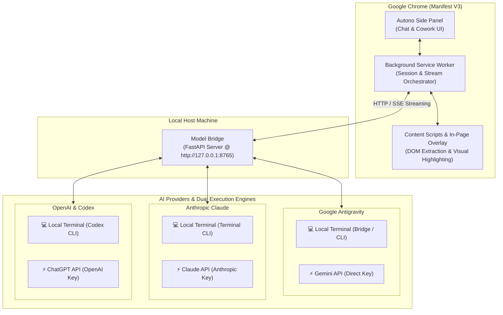

<div align="center">
  
  <h1>Autono</h1>
  <h3>⚡ Autonomous AI Browser Agent & Navigation Copilot</h3>
  <p>
    
    
    
    
  </p>
  <p>
    <em>Empowering your browser with autonomous task execution, deep semantic reasoning, and fluid agentic co-working.</em>
  </p>
</div>

---

## 🌟 Description

**Autono** is an open-source, high-performance Chrome extension (Manifest V3) that integrates frontier AI intelligence directly into your daily web browsing workflow. Designed from the ground up for speed, privacy, and autonomy, Autono offers a dual-engine architecture across three leading AI providers:

1. **Google Antigravity**:
   - **Local Terminal**: Local CLI execution via the local bridge.
   - **Gemini API**: Direct connection using your Google Gemini API key (for native Gemini models).
   - *Models*: Gemini 3.8 Flash (Ultra Fast · Recommended), Gemini 3.7 Flash, Gemini 3.6 Flash, Gemini 3.1 Pro, GPT-OSS 120B (Local Terminal / OpenAI API).
2. **Anthropic Claude**:
   - **Local Terminal**: Terminal-driven local execution.
   - **Claude API**: Direct connection using your Anthropic API key (never via Gemini API).
   - *Models*: Claude Sonnet 5.5, Claude Opus 5.5, Claude Fable 5.1, Claude Haiku 4.5.
3. **OpenAI & Codex**:
   - **Local Terminal**: Local CLI environment.
   - **ChatGPT API**: Direct connection using your OpenAI API key.
   - *Models*: GPT-6 Astra, GPT-6 Sol, GPT-6 Luna, GPT-5.6 Terra, GPT-5.6 Sol, GPT-5.6 Luna, GPT-OSS 120B.

Autono runs quietly in Chrome's native Side Panel, featuring dynamic provider branding, adaptive avatars, syntax-highlighted code blocks, LaTeX mathematics rendering via KaTeX, and an interactive background canvas.

---

## 🏗️ Architecture



---

## 🚀 How to Get Ready (Prerequisites & Setup)

Follow these steps to set up your environment:

### 1. Prerequisites
- **Google Chrome** version 120 or higher (or any Chromium browser with Manifest V3 Side Panel API support).
- **Git** installed on your system.

### 2. Install & Start the Local Model Bridge
Autono communicates with the local [**Model Bridge**](https://github.com/MatiasV3B/ModelBridge) server running on `http://127.0.0.1:8765`. **No Python installation is needed**: the installer uses [uv](https://docs.astral.sh/uv/) to create an isolated environment with its own Python.

```powershell
irm https://raw.githubusercontent.com/MatiasV3B/ModelBridge/main/install.ps1 | iex
```

This installs the Bridge into `%LOCALAPPDATA%\AntigravityBridge`, creates the Desktop / Start Menu shortcuts and starts it. (Prefer cloning? `git clone https://github.com/MatiasV3B/ModelBridge.git`, then double-click `Instalador-AntigravityBridge.bat`.)

Verify it is running by opening `http://127.0.0.1:8765/health` in your browser: you should receive a JSON status response.

### 3. Install the Extension in Chrome
1. Clone this repository (if you haven't already):
   ```bash
   git clone https://github.com/MatiasV3B/Autono.git
   cd Autono
   ```
2. Open Chrome and go to `chrome://extensions` in the address bar.
3. Turn on the **Developer mode** switch in the top-right corner.
4. Click the **Load unpacked** button.
5. Select either extension directory according to your preference:
   - **`Autono`**: Standard release version with full agent capabilities.
   - **`Autotest`**: Testing & experimental branch with synchronized engine improvements.
6. Pin your chosen extension to your Chrome toolbar by clicking the puzzle icon.

---

## 💡 How to Use

### 1. Opening Autono
- Press the global keyboard shortcut: <kbd>Alt</kbd> + <kbd>A</kbd> (**A** for **A**utono)
- Or click the **Autono** icon on your Chrome extensions toolbar.

### 2. Choosing Your AI Model & Provider
Click the model selector button in the top header to open the model drawer:
- **Tabs**: Select from `[ Antigravity ]`, `[ Claude ]`, or `[ OpenAI ]`.
- **Reasoning Controls**: Adjust thinking intensity:
  - Claude models: `Low`, `Medium`, `High`, `X-High`, `Max` (Haiku: strictly `Fast` or `Thinking`).
  - Gemini models: `Low`, `Medium`, `High`.
  - OpenAI models: `Low`, `Medium`, `High`, `X-High`, `Max`.
- **Execution Engine Switcher**:
  - In the preview panel, toggle between **Local Terminal** (local CLI / terminal) and **API** (direct key) for the active provider.

### 3. Operational Modes
- **💬 Chat Mode**:
  - Ask questions about the current page, summarize lengthy articles, extract data tables, or generate code.
  - Page context is automatically captured without modifying the page DOM.
- **🤖 Cowork Mode**:
  - Switch to Cowork mode to execute multi-step browser tasks autonomously.
  - Autono plans the workflow, inspects interactive elements, clicks links, fills forms, and reports progress.
  - A luminous blue shield overlay indicates active work on the page, with buttons to **Pause**, **Resume**, or **Intervene** at any moment.

### 4. In-Page Interactions
- **Context Chip**: Highlight any text on any webpage to see the floating `✨ Autono` chip. Click it to ask questions with that excerpt already attached as context.
- **Context Menu**: Right-click any selection or page area and select `Ask Autono`.
- **DOM Fragment Picker**: Click the attachment icon in the chat input and pick an element from the page to inspect its structure.

---

## 🔄 How to Reload

When you modify source files or pull updates, reload the extension in Chrome:

1. Open `chrome://extensions` in your browser.
2. Locate the **Autono** card.
3. Click the 🔄 **Reload** icon button on the card.
4. If you have the Autono side panel open, close and reopen it (<kbd>Alt</kbd> + <kbd>A</kbd>).
5. Refresh active webpage tabs so the newly loaded content scripts re-attach cleanly.

> [!TIP]
> You can also press <kbd>Ctrl</kbd> + <kbd>R</kbd> (or <kbd>Cmd</kbd> + <kbd>R</kbd>) on the `chrome://extensions` page to reload all unpacked extensions at once.

---

## ⬆️ How to Update

To update Autono to the latest version:

### 1. Update the Extension
```bash
cd autono
git pull origin main
node scripts/build-dist.js
```
Then, follow the [How to Reload](#-how-to-reload) steps in Chrome.

### 2. Update the Local Bridge Backend
Double-click `Actualizar-AntigravityBridge.bat` in the Bridge folder (or run `./update.ps1`). It stops the Bridge, pulls the latest code, runs `uv sync` (only installs what changed) and restarts it.

---

## ⌨️ Keyboard Shortcuts

| Shortcut | Action |
| :--- | :--- |
| <kbd>Alt</kbd> + <kbd>A</kbd> | Toggle the Autono Side Panel |
| <kbd>Enter</kbd> | Send prompt / trigger agent goal |
| <kbd>Shift</kbd> + <kbd>Enter</kbd> | Insert new line in prompt box |
| <kbd>Esc</kbd> | Dismiss model picker / cancel element picker |

*(Shortcuts can be customized anytime at `chrome://extensions/shortcuts`)*

---

## 📁 Repository Structure

```text
autono/
├── Autono/                     # Chrome Extension source (Autono Production Edition)
│   ├── assets/                 # High-resolution logos & icons (Autono, Antigravity, Claude)
│   ├── components/             # Reusable UI component modules
│   ├── content/                # Content script & in-page working overlay
│   ├── options/                # Extension options & preferences page
│   ├── side-panel/             # Side panel controller, styles, and template
│   ├── scripts/                # Distribution & packaging build scripts
│   ├── background.js           # MV3 Service Worker & streaming orchestrator
│   ├── manifest.json           # Chrome extension manifest (Autono)
│   └── package.json            # Extension metadata & dependencies
├── Autotest/                   # Chrome Extension source (Autotest Testing Edition)
│   ├── assets/                 # Logos & icons
│   ├── components/             # Reusable UI component modules
│   ├── content/                # Content script & in-page working overlay
│   ├── options/                # Extension options & preferences page
│   ├── side-panel/             # Side panel controller, styles, and template
│   ├── scripts/                # Distribution & packaging build scripts
│   ├── background.js           # MV3 Service Worker & streaming orchestrator
│   ├── manifest.json           # Chrome extension manifest (Auto Test)
│   └── package.json            # Extension metadata & dependencies
├── dist/                       # Packaged distribution builds (dist/Autono & dist/Autotest)
├── .github/                    # GitHub templates & workflows
│   ├── ISSUE_TEMPLATE/         # Bug report & feature request templates
│   └── pull_request_template.md
├── .env.example                # Sample environment configuration
├── .gitignore                  # Git ignore rules
├── CODE_OF_CONDUCT.md          # Contributor Covenant v2.1
├── CONTRIBUTING.md             # Contribution guidelines
├── LICENSE                     # MIT License
├── README.md                   # Project documentation
└── SECURITY.md                 # Security vulnerability reporting policy
```

---

## 🔒 Security & Dependencies

We do not claim Autono is "100% secure": no software is. What we do is audit it and say plainly what we find.

- **Dependency audit.** Run `cd Autono && npm audit` at any time. The advisory *"source-map-js through 1.2.1 does not validate the line offsets of indexed source maps (event-loop denial of service)"* was fixed by updating to `source-map-js@1.2.2`.
- **What still shows up.** The remaining notices (`braces`, `chokidar`, `micromatch`, `fast-glob`, `postcss-nested`, `postcss-selector-parser`, `tailwindcss`) all come from the **Tailwind CSS 3 build toolchain**. They are `devDependencies` used on a developer's machine while styling; `node scripts/build-dist.js` skips `node_modules`, so **none of them is packaged into or loaded by the extension in Chrome**. Clearing them completely needs a major upgrade to Tailwind 4, which is on the roadmap.
- **Local Bridge.** The Model Bridge listens on `127.0.0.1` only (not reachable from other machines) and is installed in an isolated `uv` environment, so it does not modify your system Python. API keys you enter are stored in the extension's local storage and are only sent to the provider you choose or to your own local Bridge.
- **Found something?** Please follow [SECURITY.md](SECURITY.md) and report it privately.

---

## 🤝 Contributing

Contributions are welcome! Please review our [Contributing Guidelines](CONTRIBUTING.md) and adhere to our [Code of Conduct](CODE_OF_CONDUCT.md).

1. Fork the repository.
2. Create your feature branch (`git checkout -b feature/awesome-feature`).
3. Commit your changes (`git commit -m 'Add awesome feature'`).
4. Push to the branch (`git push origin feature/awesome-feature`).
5. Open a Pull Request.

---

## 📄 License

Distributed under the MIT License. See [`LICENSE`](LICENSE) for details.
