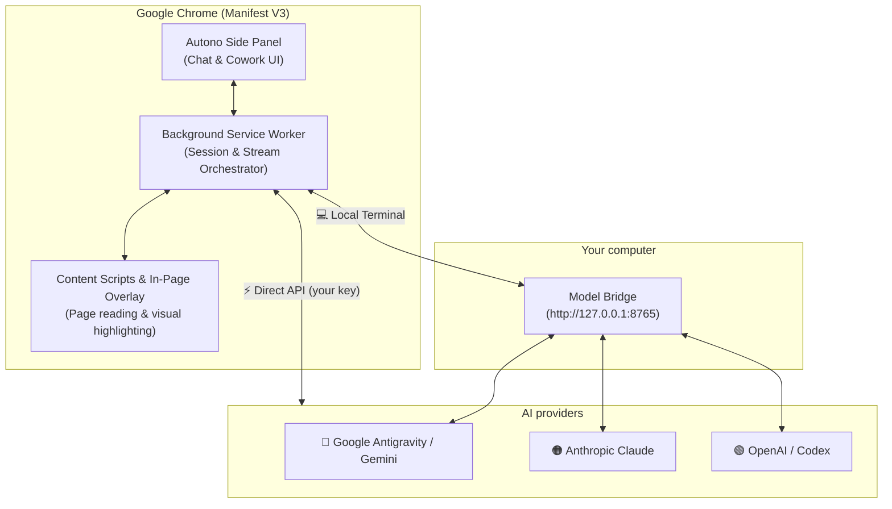

<div align="center">
  
  <h1>Autono</h1>
  <h3>⚡ The AI browser agent that lives in your Chrome side panel</h3>
  <p>
    Chat with the page you are on, or let the AI <b>click, type and navigate for you</b>.<br/>
    Works with <b>Google Gemini · Anthropic Claude · OpenAI / ChatGPT</b> — through a local terminal <i>or</i> your own API key.
  </p>
  <p>
    
    
    
    
  </p>
  <p>
    🌐 <b>English</b> · <a href="README.es.md">Español</a>
  </p>
  <p>
    <a href="#-quick-start-5-minutes">Quick start</a> ·
    <a href="#-what-can-you-do-with-autono">Use cases</a> ·
    <a href="#-step-by-step-setup">Setup</a> ·
    <a href="#-using-autono">How to use</a> ·
    <a href="#-troubleshooting--faq">FAQ</a>
  </p>
</div>

---

> [!TIP]
> **If Autono saves you time, please give it a ⭐ on GitHub.** It is the easiest way to help other people find it.

## 📖 Table of contents

1. [What is Autono?](#-what-is-autono)
2. [What can you do with Autono?](#-what-can-you-do-with-autono)
3. [Quick start (5 minutes)](#-quick-start-5-minutes)
4. [Step-by-step setup](#-step-by-step-setup)
5. [Using Autono](#-using-autono)
6. [Supported providers & models](#-supported-providers--models)
7. [How it works](#-how-it-works)
8. [Keyboard shortcuts](#-keyboard-shortcuts)
9. [Updating & reloading](#-updating--reloading)
10. [Troubleshooting & FAQ](#-troubleshooting--faq)
11. [Security & privacy](#-security--privacy)
12. [Repository structure](#-repository-structure)
13. [Contributing](#-contributing) · [License](#-license)

---

## 🌟 What is Autono?

**Autono** is a free, open-source **Chrome extension** (Manifest V3) that puts a powerful AI assistant in Chrome's **side panel**, right next to the page you are reading.

It has two modes:

| Mode | What it does | Example |
| :--- | :--- | :--- |
| 💬 **Chat** | Reads the page you are on and answers questions about it. It never modifies the page. | *"Summarize this article in 5 bullet points."* |
| 🤖 **Cowork** | An **agent** that plans a multi-step task and then does it in your browser: it clicks, types, scrolls and navigates, and tells you what it is doing. You can pause or take over at any moment. | *"Find the cheapest direct flight to Madrid next Friday and fill in the search form."* |

**Why people like it**

- 🔌 **You choose the brain.** Use Gemini, Claude or OpenAI models — switch with one click.
- 🧰 **Two ways to connect.** Use a **local terminal** (the CLI of each provider, through a small local program called the *Model Bridge*) **or** paste your own **API key** and talk to the provider directly.
- 🔒 **Private by design.** No Autono server in the middle. Your keys and chats stay on your computer.
- 🧠 **Control how hard it thinks.** Low / Medium / High reasoning levels per model.
- 🆓 **Free and open source (MIT).**

---

## 🎯 What can you do with Autono?

Real situations where Autono helps. Copy any of the example prompts.

### 📚 Students & researchers
- *"Explain this paper's method like I'm 15, then list its 3 main limitations."*
- *"Extract every table on this page and give it to me as CSV."*
- Math and science answers are rendered with proper **LaTeX** formulas and syntax-highlighted code.

### 💻 Developers
- Select code on any page (docs, Stack Overflow, GitHub) → click the floating **✨ Autono** chip → *"What does this do and where could it fail?"*
- *"Write the complete code for this, no placeholders."* Autono returns full files you can copy or download.
- Use the **DOM fragment picker** to point at a page element and ask *"why is this button misaligned?"*

### 🛒 Shopping, travel & everyday errands (Cowork mode)
- *"Compare the three laptops open in my tabs and tell me which one is the best value."*
- *"Open the booking page, search for these dates, and stop before payment."*
- Autono can ask for your approval with interactive **approval cards** before important steps.

### ✍️ Writers & office work
- Highlight a paragraph → *"Rewrite this to sound more professional."*
- *"Summarize this long email thread and draft a polite reply."*
- Attach several tabs as context and ask questions across all of them.

### 🧪 Power users & automation fans
- **Slash commands** such as `/goal` (run until done), `/schedule` (recurring tasks), `/grill-me` (it interviews you before acting), `/teamwork` and `/learn` (turn finished work into a reusable skill).
- Connect **MCP servers** and create your own **reusable skills**.
- **Shadow mode**: let your PC sleep or shut down automatically when a long task finishes.

---

## ⚡ Quick start (5 minutes)

Pick **one** path. You can always add the other later.

| | 🅰️ **API key path** (simplest) | 🅱️ **Local terminal path** |
| :--- | :--- | :--- |
| **You need** | An API key from Google, Anthropic or OpenAI | A signed-in CLI (Antigravity / Claude Code / Codex) + the Model Bridge |
| **Install the Bridge?** | ❌ No | ✅ Yes (one command) |
| **Cost** | Pay-as-you-go with your key | Uses your existing subscription / sign-in |
| **Best for** | Getting started quickly | Using models you already have access to in a terminal |

**The 3 steps (both paths):**

1. **Get the extension** → download this repo (`git clone https://github.com/MatiasV3B/Autono.git`).
2. **Load it in Chrome** → `chrome://extensions` → *Developer mode* → *Load unpacked* → choose the **`Autono`** folder.
3. **Connect a model** → open Autono with <kbd>Alt</kbd> + <kbd>Shift</kbd> + <kbd>A</kbd>, open ⚙️ *Settings*, and either paste an API key (path A) or install the Bridge (path B). Full instructions below 👇

---

## 🛠️ Step-by-step setup

### Step 0 — What you need

- **Google Chrome 120 or newer** (or any Chromium browser with Manifest V3 + Side Panel support).
- **Windows 10/11** if you will use the **Model Bridge** (path B). The extension itself works on any system Chrome runs on.
- **Git** (only to download the project; you can also use *Code → Download ZIP* on GitHub).

### Step 1 — Download the extension

```bash
git clone https://github.com/MatiasV3B/Autono.git
```

### Step 2 — Load it in Chrome

1. Open `chrome://extensions` in the address bar.
2. Turn on **Developer mode** (switch in the top-right corner).
3. Click **Load unpacked** and select the **`Autono`** folder inside the project.
4. Click the 🧩 puzzle icon in Chrome and **pin** Autono to your toolbar.

> [!NOTE]
> If Chrome shows *"Could not load extension"*, make sure you selected the `Autono` folder (the one that contains `manifest.json`) and that you have the latest version (`git pull`).

### Step 3A — Connect with an API key (no Bridge needed)

1. Open Autono (<kbd>Alt</kbd> + <kbd>Shift</kbd> + <kbd>A</kbd> or click the icon) and open ⚙️ **Settings**.
2. Paste the key of the provider you want:

| Provider | Where to create the key |
| :--- | :--- |
| 🔷 **Google Gemini** | [Google AI Studio → API keys](https://aistudio.google.com/apikey) |
| 🟠 **Anthropic Claude** | [Anthropic Console → API keys](https://console.anthropic.com/settings/keys) |
| 🟢 **OpenAI / ChatGPT** | [OpenAI Platform → API keys](https://platform.openai.com/api-keys) |

3. In the model picker choose the provider's tab and switch its engine to **API**.
4. Press **Reload models** (🔄) to load the real list of models your key can use. Done!

> [!IMPORTANT]
> Treat API keys like passwords. Never share them or post screenshots that show them.

### Step 3B — Connect with the local terminal (Model Bridge)

The **Model Bridge** is a small program that runs on your PC and lets Autono use the command-line tools you are already signed in to.

1. **Install it with one command.** Open **PowerShell** and run:

   ```powershell
   irm https://raw.githubusercontent.com/MatiasV3B/ModelBridge/main/install.ps1 | iex
   ```

   This installs everything in an isolated environment — **you do not need to install Python** — creates a desktop shortcut and starts the Bridge.
2. **Check it is running.** Open <http://127.0.0.1:8765/health> in Chrome. You should see something like `{"status":"online", ...}`.
3. **Sign in to the provider you want to use** (once):
   - **Google Antigravity** → the installer sets up the `agy` CLI; sign in from the Bridge app with *Iniciar sesión*.
   - **Claude** → install and sign in to *Claude Code*.
   - **OpenAI / Codex** → install and sign in to the *Codex CLI*.
4. In Autono's model picker, choose the provider tab and keep its engine on **Local Terminal**. Press **Reload models** (🔄) to load what your Bridge offers.

> [!NOTE]
> Models shown in the **Antigravity** tab under **“Antigravity · Local Terminal”** always run on your local terminal. Models under **“Gemini API”** always use your Gemini API key.

---

## 💡 Using Autono

### Open it
- Press <kbd>Alt</kbd> + <kbd>Shift</kbd> + <kbd>A</kbd> (**A** for **A**utono), **or** click the Autono icon in the toolbar.

### Pick a model and how hard it thinks
Click the model button at the top:
- **Tabs:** `Antigravity` · `Claude` · `OpenAI`.
- **Reasoning level:** Low / Medium / High (Claude and OpenAI also offer X-High and Max; Claude Haiku offers Fast or Thinking).
- **Engine:** in the preview panel, switch between **Local Terminal** and **API**.
- **🔄 Reload models:** fetches the current list from your Bridge and/or your API keys and keeps only the newest model of each family so the list stays short and clear.

### Chat mode 💬
Ask anything about the page. Autono reads the page content automatically (without changing it). Attach files, other tabs or a specific page element for extra context.

### Cowork mode 🤖
Describe a goal and Autono will:
1. Show you a **plan**.
2. Inspect the page and carry out the steps (click, type, scroll, navigate).
3. Report progress and the final result.

While it works, a glowing blue overlay shows the page is under Autono's control. You can **Pause**, **Resume** or **Intervene** at any time, and it can ask for your approval (approval cards) before important steps.

### Handy shortcuts inside web pages
- **✨ Context chip:** select text on any page and click the floating chip to ask about it.
- **Right-click → “Ask Autono”** on a selection or page area.
- **Attachment icon → DOM picker:** click an element on the page to attach it.

### More features
- **Slash commands:** type `/` in the prompt box to see them (`/goal`, `/schedule`, `/grill-me`, `/teamwork`, `/learn`, …).
- **Chat history** with folders, search and rename. Titles are generated automatically by the model.
- **Custom skills**, **MCP servers**, and up to **5 extra OpenAI-compatible providers** (for example OpenRouter or Groq).
- **Themes, languages, typography and audio** options, plus an optional **web-search key** (TinyFish).

---

## 🧠 Supported providers & models

| Provider | Local Terminal | Direct API | Models (newest versions are loaded automatically) |
| :--- | :---: | :---: | :--- |
| 🔷 **Google Antigravity / Gemini** | ✅ via the Bridge | ✅ Gemini API key | Gemini 3.8 Flash, 3.7 Flash, 3.6 Flash, 3.1 Pro · GPT-OSS 120B · Claude Sonnet 5.5 and Opus 5.5 (local terminal only) · plus every chat-capable model of your Gemini API |
| 🟠 **Anthropic Claude** | ✅ Claude Code via the Bridge | ✅ Anthropic API key | Claude Sonnet 5.5 · Opus 5.5 · Fable 5.1 · Haiku 4.5 |
| 🟢 **OpenAI / Codex** | ✅ Codex via the Bridge | ✅ OpenAI API key | The latest GPT and Codex models offered to your account |

> [!NOTE]
> Model lists change quickly. Autono asks your Bridge or API for the current catalog each time you press **Reload models**, and hides models that cannot be used for chat (for example computer-use, robotics, transcription or image-generation variants).

---

## 🏗️ How it works



In plain words: the **side panel** is what you see, the **background worker** coordinates everything, and the **content scripts** read and act on the web page. To reach an AI model, Autono either goes through the **Model Bridge** on your own computer (Local Terminal) or calls the provider **directly** with your API key.

---

## ⌨️ Keyboard shortcuts

| Shortcut | Action |
| :--- | :--- |
| <kbd>Alt</kbd> + <kbd>Shift</kbd> + <kbd>A</kbd> | Open / close the Autono side panel |
| <kbd>Enter</kbd> | Send the message / start the goal |
| <kbd>Shift</kbd> + <kbd>Enter</kbd> | New line in the prompt box |
| <kbd>Esc</kbd> | Close the model picker / cancel the element picker |

You can change the shortcut at any time in `chrome://extensions/shortcuts`.

---

## 🔄 Updating & reloading

**Update the extension**

```bash
cd Autono
git pull origin main
```

Then open `chrome://extensions`, click 🔄 **Reload** on the Autono card, close and reopen the side panel, and refresh your open tabs.

**Update the Model Bridge** — double-click `Actualizar-AntigravityBridge.bat` in the Bridge folder (or run `./update.ps1`). It stops the Bridge, downloads the latest code, updates only what changed and starts it again.

---

## 🩺 Troubleshooting & FAQ

<details>
<summary><b>Chrome says “Could not load extension” / manifest error</b></summary>

Select the folder that directly contains `manifest.json` (the `Autono` folder). Run `git pull` to get the latest version and try again.
</details>

<details>
<summary><b>The shortcut does nothing (or opens another app)</b></summary>

Another program may already use that key combination. Go to `chrome://extensions/shortcuts` and set a different shortcut for Autono. Chrome only allows combinations that use <kbd>Ctrl</kbd> or <kbd>Alt</kbd>, optionally with <kbd>Shift</kbd>.
</details>

<details>
<summary><b>“Could not connect to Bridge” / the model list is empty</b></summary>

1. Open <http://127.0.0.1:8765/health>. If it does not load, start the Bridge from its desktop shortcut or `Iniciar-AntigravityBridge.bat`.
2. In Autono ⚙️ Settings check that the **Bridge URL** is `http://127.0.0.1:8765`.
3. Press **Reload models** 🔄.

Using only API keys? You do not need the Bridge — make sure the provider's engine is set to **API** and the key is saved.
</details>

<details>
<summary><b>My API models do not load</b></summary>

Check that the provider's engine is set to **API**, that the key is correct, and press **Reload models** 🔄. The toast message tells you how many models each source returned or why it failed (for example “invalid API key”).
</details>

<details>
<summary><b>Claude from “Antigravity” does not use my Claude API key</b></summary>

By design. Claude models listed in the **Antigravity** tab run on your **local terminal**. To use the official Claude API, open the **Claude** tab, pick the model there and set its engine to **API**.
</details>

<details>
<summary><b>I see “Your previous response was blocked by content safety filters”</b></summary>

That message comes from the model provider, not from Autono. Autono retries the same request once automatically. If it happens again, try again, rephrase your message, or switch to another model.
</details>

<details>
<summary><b>Windows blocks the Bridge installer’s Python (“Application Control policy”)</b></summary>

The installer detects this and falls back to a Python you already have installed (3.10 or newer from python.org). If you have none, install one from <https://www.python.org/downloads/> and run the installer again.
</details>

<details>
<summary><b>Does Autono work on Mac or Linux?</b></summary>

The **extension** works anywhere Chrome runs, with API keys. The one-click **Model Bridge** installer and its desktop app are Windows-first; on other systems you can run the Bridge in headless mode (see the [ModelBridge repo](https://github.com/MatiasV3B/ModelBridge)).
</details>

---

## 🔒 Security & privacy

We do not claim Autono is “100% secure”: no software is. What we do is audit it and say plainly what we find.

- **No middleman.** Autono has no server of its own. Your chats go to the provider you chose (or to the Bridge on your own computer).
- **Your keys.** API keys are stored in the extension’s local storage and are only sent to the provider you choose or to your own local Bridge. Never share them.
- **Local Bridge.** It listens on `127.0.0.1` only (not reachable from other machines) and runs in an isolated `uv` environment, so it does not touch your system Python.
- **Dependency audit.** Run `cd Autono && npm audit` at any time (currently **0 vulnerabilities**). The `source-map-js` advisory (event-loop denial of service through indexed source-map offsets) was fixed by updating to `source-map-js@1.2.2`, and the rest of the notices came from the Tailwind CSS 3 build toolchain, which was migrated to **Tailwind CSS 4**. Those were `devDependencies` used only while styling; `node scripts/build-dist.js` never packages `node_modules`, so they were never loaded by the extension in Chrome.
- **You stay in control.** Cowork shows its plan, can ask for your approval on important steps and can be paused or stopped at any time.
- **Found a vulnerability?** Please follow [SECURITY.md](SECURITY.md) and report it privately.

---

## 📁 Repository structure

```text
autono/
├── Autono/                     # The Chrome extension (load this folder in Chrome)
│   ├── assets/                 # Logos & icons
│   ├── components/             # Reusable UI components
│   ├── content/                # Content script & in-page overlay
│   ├── options/                # Options page
│   ├── side-panel/             # Side panel UI, logic and styles
│   ├── scripts/                # Packaging scripts
│   ├── background.js           # Service worker: sessions, streaming, routing
│   ├── manifest.json           # Extension manifest
│   └── package.json            # Metadata & dev dependencies
├── dist/                       # Packaged build (generated)
├── .github/                    # Issue & pull-request templates
├── CODE_OF_CONDUCT.md · CONTRIBUTING.md · SECURITY.md · LICENSE
├── README.md                   # This file (English)
└── README.es.md                # Spanish version
```

---

## 🤝 Contributing

Contributions are welcome! Please read the [Contributing Guidelines](CONTRIBUTING.md) and the [Code of Conduct](CODE_OF_CONDUCT.md).

1. Fork the repository.
2. Create a branch: `git checkout -b feature/awesome-feature`.
3. Commit your changes: `git commit -m "Add awesome feature"`.
4. Push the branch: `git push origin feature/awesome-feature`.
5. Open a Pull Request.

Found a bug or have an idea? [Open an issue](https://github.com/MatiasV3B/Autono/issues).

---

## 📄 License

Distributed under the MIT License. See [`LICENSE`](LICENSE).

<div align="center">
  <br/>
  <b>⭐ Star Autono if it helps you — it makes it easier for others to find it.</b>
  <br/><br/>
  <sub>
    Keywords: AI browser agent · Chrome side panel extension · autonomous web agent · browser automation ·
    Gemini · Claude · ChatGPT · OpenAI · Anthropic · Google Antigravity · Manifest V3 · AI copilot ·
    web scraping assistant · local LLM bridge
  </sub>
</div>
